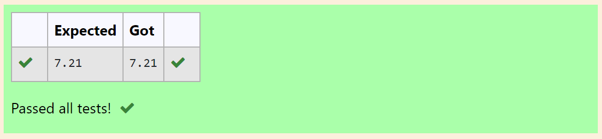

# DISTANCE-BETWEEN-TWO-POINTS

## AIM:
To write a python program to find the distance two 2 points
## ALGORITHM:
### Step 1:
Get the first value from user 
### Step 2: 
Get the second value from user
### Step 3: 
Substitute the values in the distance formula  
### Step 4:
Print the values using distance formula 
### Step 5: 
End the program
### PROGRAM:
```
import math
x=[10,4]
y=[6,2]
value=math.sqrt(((x[0]-x[1])**2)+((y[0]-y[1])**2))
print("{:.2f}".format(value))
```
  
### OUTPUT:



### RESULT:
Thus the distance of two points are founded.

